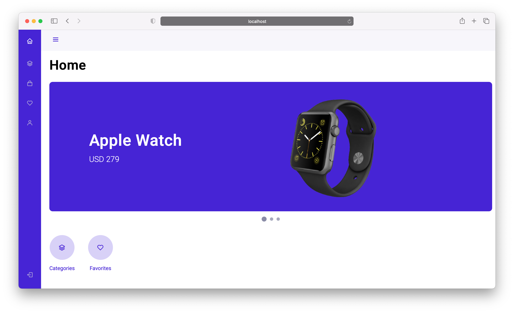
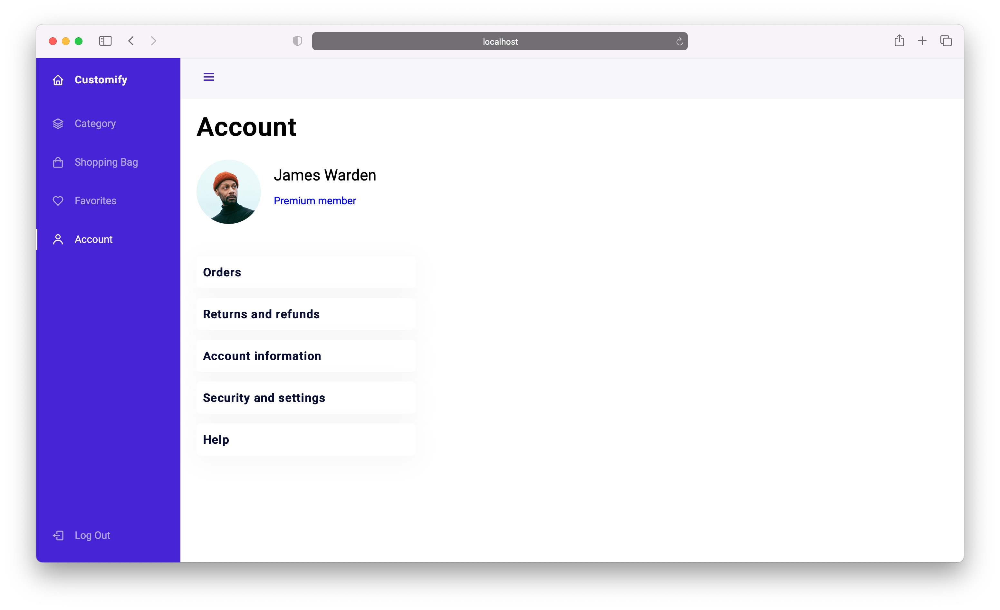
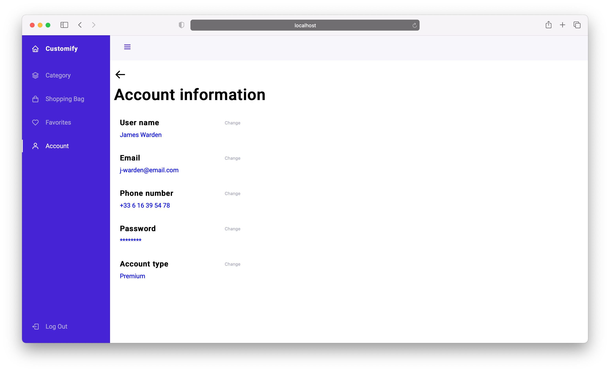

# Customify

Fullstack application based on monorepo architecture.
<br>
An e-commerce system that provides great customization options.

## Technologies Reference

### Workspace

- [Nrwl Nx](https://nx.dev)

### Client

- [Angular](https://angular.io)
- [Angular CLI](https://cli.angular.io/)

### Server

- [NestJS](https://nestjs.com/)

### [Libraries](#libraries)

- api-interfaces
- data-access
- ui
- util

### Testing

- [Cypress](https://www.cypress.io/)
- [Jest](https://jestjs.io/)

### Documentation

- [Compodoc](https://compodoc.github.io/compodoc/)


### Database

- MySQL

## Applications

### Api

Provides REST Api with which you can communicate with the MySql database. <br>
It is written in Node.js using the Nest.js framework. <br>
The API is generally RESTFULL and return results in JSON. <br>

#### Resource components

Major resource components supported by the API are:

- products
- users

These can be used alone like this

| resource | description |
-----------|-------------|
`GET /api/products` | returns a list of all products |
`GET /api/products/:id` | returns the product with the given id |
`POST /api/products` | creates a single product based on the provided data |
`PUT /api/products/:id` | change of product data with the given id |
`DELETE /api/products/:id` | removes the product with the given id |

#### Clone the repository, install node packages and verify routes locally

```
//on local
git clone https://github.com/Pablogith/customify.git
cd customify
npm install
nx serve api
```

#### Modules
- ProductModule
- AuthModule
- UserModule


### Admin

Angular application that provides the ability to edit the content of client applications. <br>

#### Run Admin application
```
//on local
git clone https://github.com/Pablogith/customify.git
cd customify
npm install
nx serve admin
```

If you checked the repository before, use only this command
```
nx serve admin
```

### Client

Angular application for users. <br>

#### Run Admin application
```
//on local
git clone https://github.com/Pablogith/customify.git
cd customify
npm install
nx serve client
```

If you checked the repository before, use only this command
```
nx serve client
```

#### Screenshots

<i>Home page</i>


<i>Account page</i>


<i>Account inforamtion page</i>


### Libraries

#### Api interfaces
Api interfaces for the client, admin and api

Import the `@customify/api-interfaces` and add to your angular module.

```typescript
export interface IProduct {
  name: string;
  price: number;
  readonly id: string | number;
  description: string;
  brand: string;
  imgUrl: string;
  imgAlt: string;
}
```

```typescript
export interface IUser {
  id: number;
  username: string;
  password?: string;
  email?: string;
}

```

#### Data Access
Data access services

Import the `@customify/data-access` and add to your angular module.

```typescript
import { BrowserModule } from '@angular/platform-browser'
import { NgModule } from '@angular/core'
import { DataAccessModule } from '@customify/data-access'

import { AppComponent } from './app.component'

@NgModule({
  declarations: [AppComponent],
  imports: [
    BrowserModule,
    DataAccessModule
  ],
  providers: [],
  bootstrap: [AppComponent]
})
export class AppModule {}
```

##### Services
- product

```typescript
import { ProductService } from '@customify/data-access';
```

```typescript
interface IProductService {
  getAll<T>(): Observable<T>;
  getById<T>(id: number | string): Observable<T>;
  add<T>(product: T): Observable<T>;
  update<T>(id: number, product: T): Observable<Object>;
  delete<T>(id: number): Observable<T>;
}
```

##### Interceptors
- http-error

```typescript
import { BrowserModule } from '@angular/platform-browser';
import { NgModule } from '@angular/core';
import { AppComponent } from './app.component';
import { DataAccessModule, HttpErrorInterceptor } from '@customify/data-access';
import { HTTP_INTERCEPTORS } from '@angular/common/http';

@NgModule({
  declarations: [
    AppComponent
  ],
  imports: [
    BrowserModule,
    DataAccessModule
  ],
  providers: [
    {
      provide: HTTP_INTERCEPTORS,
      useClass: HttpErrorInterceptor,
      multi: true
    }
  ],
  bootstrap: [AppComponent],
})
export class AppModule {}
```

#### Ui
User Interface module with components and pipes

##### Add the module to application
Import the `@customify/ui` and add to your angular module.

```typescript
import { BrowserModule } from '@angular/platform-browser'
import { NgModule } from '@angular/core'
import { UiModule } from '@customify/ui'

import { AppComponent } from './app.component'

@NgModule({
  declarations: [AppComponent],
  imports: [
    BrowserModule,
    UiModule
  ],
  providers: [],
  bootstrap: [AppComponent]
})
export class AppModule {}
```

##### Components

- [banner](#banner-component)
- [button](#button-component)
- [loader](#loader-component)
- [navbar](#navbar-component)
- [page-intro-header](#page-intro-header-component)
- [product](#product-component)
- [table](#table-component)

##### Pipes

- [truncate](#truncate-pipe)

##### Banner Component

<h3 style="margin-bottom: 0">Input data</h3> <br>

| Attribute | Type |
| --------- | ---- |
| bannerData | IBanner |

```typescript
interface IBanner {
  title: string;
  description: string;
  img?: string;
  backgroundColor?: string;
  height?: number;
  textColor?: string;
}
```

<h3 style="margin-bottom: 0">Usage</h3> <br>
```html
<ui-banner [bannerData]='banner'>
</ui-banner>
```

```typescript
const banner: IBanner = {
  title: 'My first banner',
  description: 'Whats up?',
  height: 300,
  backgroundColor: 'rgb(31,165,33)',
  textColor: 'rgb(255, 255, 255)'
}
```

##### Button Component
<h3 style="margin-bottom: 0">Input data</h3> <br>

| Attribute | Type |
| --------- | ---- |
| status | buttonStatus |
| size | buttonSize |
| disabled | boolean |

```typescript
const defaultConfig = {
  size: buttonSize.MEDIUM,
  status: buttonStatus.DEFAULT
}
```

```typescript
enum buttonStatus {
  DEFAULT = 'default',
  PRIMARY = 'primary',
  SECONDARY = 'secondary',
  SUCCESS = 'success',
  INFO = 'info',
  WARNING = 'warning'
}

enum buttonSize {
  SMALL = 'small',
  MEDIUM = 'medium',
  LARGE = 'large',
  GIANT = 'giant'
}
```
<h3 style="margin-bottom: 0">Usage</h3> <br>

```html
<ui-button>Click me!</ui-button>
```


##### Loader Component

<h3 style="margin-bottom: 0">Usage</h3> <br>

```html
<ui-loader *ngIf='isLoading'></ui-loader>
```

##### Navbar Component

<h3 style="margin-bottom: 0">Input data</h3> <br>

| Attribute | Type |
| --------- | ---- |
| navElements | Array\<INavElement> |
| title | string |

```typescript
const deafaultTitle: string = 'Customify';
```

```typescript
interface INavElement {
  name: string;
  routerLink: string;
  classes: string;
}
```

<h3 style="margin-bottom: 0">Usage</h3> <br>

[Icons classes is here](https://boxicons.com)

```html
<ui-navbar [navElements]='navElements'>
  <router-outlet></router-outlet>
</ui-navbar>
```

```typescript
public navElements: Array<INavElement> = [];

this.navElements.push(
      { routerLink: '/dashboard', name: 'dashboard', classes: 'bx bxs-dashboard' },
      { routerLink: '/account-page-header', name: 'profile', classes: 'bx bx-user' }
    );
```

```html
// index.html
// Add to head
<link href='https://cdn.jsdelivr.net/npm/boxicons@2.0.5/css/boxicons.min.css' rel='stylesheet'>
```

```scss
// styles.scss
$header-height: 3rem;
$nav-width: 68px;

$main-color: #4723D9;
$main-color-light: #AFA5D9;
$white-color: #f7f6fb;
$grey-color: #404040;

$body-font: 'Nunito', sans-serif;
$normal-font-size: 1rem;

/*===== z index =====*/
$z-fixed: 100;

*,::before,::after{
  box-sizing: border-box;
}

body {
  position: relative;
  margin: $header-height 0 0 0;
  padding: 0;
  font-family: $body-font;
  font-size: $normal-font-size;
  transition: .5s;
}

a {
  text-decoration: none;
}

ul {
  list-style: none;
  padding: 0;
}

html,
body {
  height: 100%;
}

body {
  margin: 0;
  font-family: Roboto, "Helvetica Neue", sans-serif;
}
```

##### Page Intro Header Component

<h3 style="margin-bottom: 0">Input data</h3> <br>

| Attribute | Type |
| --------- | ---- |
| headerData | IPageIntroHeaderData |

```typescript
interface IPageIntroHeaderData {
  title: string;
  url?: string;
  alt?: string;
}
```

<h3 style="margin-bottom: 0">Usage</h3> <br>

```html
<ui-page-intro-header [headerData]='pageIntroHeaderData'></ui-page-intro-header>
```

##### Product Component

<h3 style="margin-bottom: 0">Input data</h3> <br>

| Attribute | Type |
| --------- | ---- |
| product | any |

<h3 style="margin-bottom: 0">Usage</h3> <br>

```html
<ui-product [product]='product'></ui-product>
```

##### Table component

<h3 style="margin-bottom: 0">Input data</h3> <br>

| Attribute | Type |
| --------- | ---- |
| tableData | ITable\<T> |

```typescript
interface ITableData<T> {
  columns: Array<string>;
  body: Array<T>
}
```

<h3 style="margin-bottom: 0">Usage</h3> <br>

```html
<ui-table [tableData]='productsTableData'></ui-table>
```

##### Truncate pipe

<h3 style="margin-bottom: 0">Usage</h3> <br>

```html
<h1>{{ veryLongWord | truncate }}</h1>
```

##### Running storyboook test
Run `npx ng run component:storybook --project=ui`


## Understand your workspace

Run `nx dep-graph` to see a diagram of the dependencies of your projects. <br>
Or open `documentation/index.html` in your browser (Compodoc docs).
